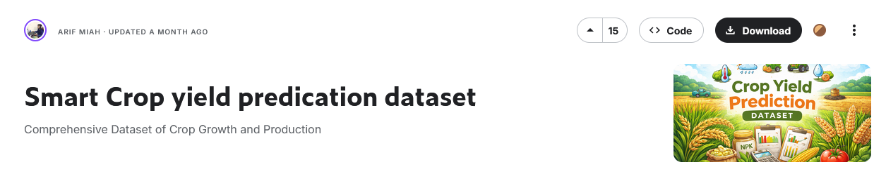

```
------------- ESPECIALIZACIÓN EN INTELIGENCIA ARTIFICIAL Y BIG DATA -------------
---------------------------------------------------------------------------------

Módulo:                     BIG DATA APLICADO
Profesor:                   Víctor J. González
Unidad de Trabajo:          UT05. Procesamiento distribuido con PySpark
Práctica:                   PR0501. Ingesta de datos de ficheros CSV
Resultados de aprendizaje:  RA1
```

# PR0501. Ingesta de datos de ficheros CSV

En esta primera práctica practicaremos con la carga de datos en dataframes de Spark. Para cada uno de los ejercicios tienes que cargar el dataset referenciado definiendo tú previamente el esquema. Una vez que lo hayas hecho muestra el esquema del dataframe y muestra los 5 primeros registros.

## Dataset 1: Datos para la predicción del rendimiento en cultivos



[Kaggle: Smart Crop yield predication dataset](https://www.kaggle.com/datasets/miadul/smart-crop-yield-predication-dataset)


## Dataset 2: Lugares famosos del mundo


[Kaggle: World Famous Places](https://www.kaggle.com/datasets/shaistashahid/world-famous-places)


## Dataset 3: Registro turístico de Castilla y León


[Datos Abierto Junta de Castilla y León: Registro turístico completo (CSV)](https://datosabiertos.jcyl.es/web/jcyl/set/es/turismo/retu/1285002755102)