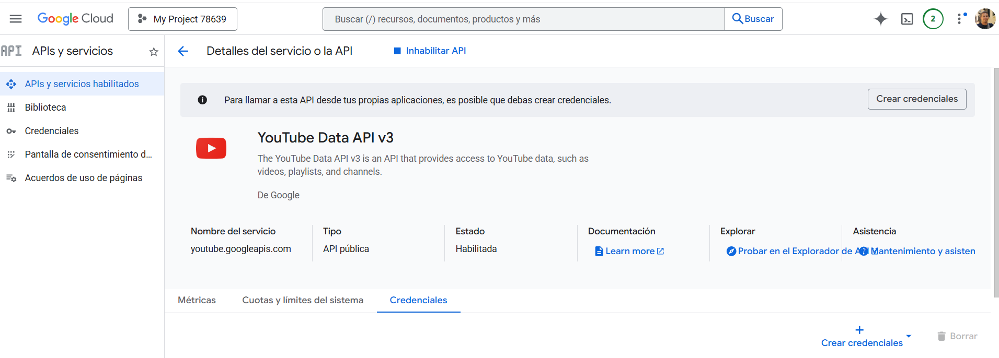
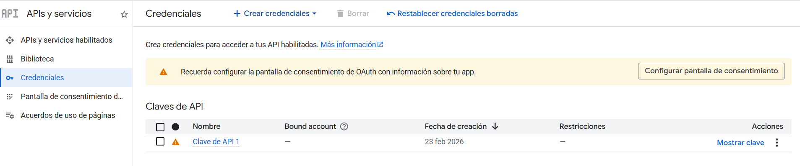
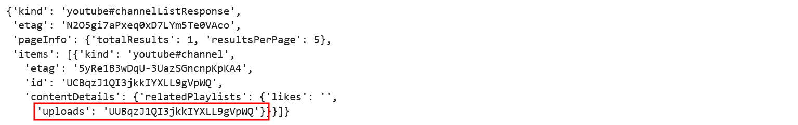
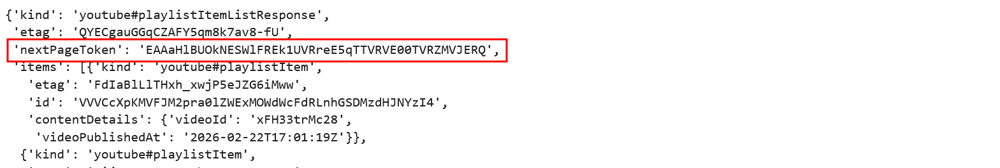

```
------------- ESPECIALIZACIÓN EN INTELIGENCIA ARTIFICIAL Y BIG DATA -------------
---------------------------------------------------------------------------------

Módulo:                     SISTEMAS DE BIG DATA
Profesor:                   Víctor J. González
Unidad de Trabajo:          UT03. Gestión de los datos
Práctica:                   PR0304: API de You Tube
Resultados de aprendizaje:  
```


# PR0304: Auditoría y evolución de un canal de YouTube

## 1. Contexto del Proyecto

Vamos a seguir practicando con extración de datos de APIs. En este caso usaremos la API de YouTube para 


## 2. Pasos previos

Para esta práctica necesitarás registrarte en la API de datos de Youtube. Aunque los resumo a continuación, tienes toda la información en esta [página web](https://developers.google.com/youtube/v3/getting-started?hl=es-419).

Los pasos a realizar son:

### Habilitar la API

Vete a la [Consola de Google Developers](https://console.cloud.google.com/apis/dashboard) y en *Habilitar APIs y servicios* busca la API **YouTube Data API v3** y la activas.




### Obtención de credenciales

Ahora debes crear las credenciales para poder conectarte a la API, para ello busca el botón **Crear credenciales** donde seleccionamos *Datos públicos*

Tras aceptar, ya tendrás disponible tu clave de API en el apartado *Credenciales*.




## 3.- Objetivo de la práctica

El objetivo de esta práctica será, a partir de un canal de YouTube, ingerir todo el catálogo histórico de vídeos y sus métricas actuales (vistas, duración, likes).

Algunas cuestiones que tienes que tener en cuenta son:

1. **Navegación por la arquitectura de una API**: en esta ocasión no vas a tener todos los datos en un solo endpoint, sino que deberás: primero buscar el canal, luego su lista de videos, y luego las estadísticas de cada video.
2. **Manejo la paginación**: tendrás que usar tokens (nextPageToken) para extraer listas que superan el límite máximo de resultados por petición (50).
3. **Peticiones por lotes (Batching)**: algo importante aquí también será agrupar IDs para no agotar la cuota de la API (hacer 1 petición para 50 videos en lugar de 50 peticiones individuales).
4. **Limpieza de datos (Parsing)**: y por último, también tendrás que transformar formatos estándar (como las duraciones en ISO 8601 PT1H5M33S) a formatos numéricos útiles para el análisis (segundos).


Los *endpoints* que deberás usar son:

### [`Channels: list`](https://developers.google.com/youtube/v3/docs/channels/list)

Este *endpoint* lo usaremos para obtener el ID de la lista *Uploads*. En la página de la guía de referencia tienes una relación de todos los parámetros que puede recibir, pero los que necesitas son:

- `part`: para indicarle qué propiedades del canal queremos obtener. El valor en tu caso debe ser `contentDetails`.
- `id`: con el identificador del canal del cual quieres obtener la información
- `key`: tu API Key

Fíjate que tendrás que navegar por el JSON para obtener la clave que nos interesa (`uploads`)




### [`PlaylistItems: list`](https://developers.google.com/youtube/v3/docs/playlists/list)

Este *endpoint* servirá para obtener la lista de vídeos a partir del Id de la lista *uploads*. 

Aquí lo importante es que no te mostrará todos los resultados en una misma página, sino que los resultados los mostrará de 50 en 50, por lo que deberás gestionar la paginación. Para ello tienes que comprobar la clave `nextPageToken` y, si existe, quiere decir que hay por lo menos otra página más de resultados.



El objetivo aquí será obtener un listado de todos los Ids de los vídeos de este canal.


### [`Videos: list`](https://developers.google.com/youtube/v3/docs/videos/list)

Una vez que ya tienes el listado de todos los identificadores de los ids de los vídeos del canal será el momento de obtener los datos de cada vídeo (título, fecha_publicación, vistas, likes, comentarios y duración ISO)


## 4. Almacenamiento de los datos

Por último, una vez que hayas obtenido todos los datos, deberás almacenar el dataframe en formato `.parquet`.


## 5. Plantilla

A continuación tienes una plantilla del código para que te puedas centrar en las funciones propias de la consulta a la API.


```python
import requests
import pandas as pd
import math

# CONFIGURACIÓN
API_KEY = 'TU_API_KEY_AQUI'
CHANNEL_ID = 'ID_DEL_CANAL' 
BASE_URL = 'https://www.googleapis.com/youtube/v3'


# FUNCIONES DE INGESTA
# --------------------
def get_uploads_playlist_id(channel_id):
    """Paso 1: Obtener el ID de la lista de reproducción 'Uploads' del canal"""
    url = f"{BASE_URL}/channels?part=contentDetails&id={channel_id}&key={API_KEY}"
    response = requests.get(url).json()
    
    try:
        # TODO: Extrae el id del playlist (está en la clave uploads)
        # ...
        
        return playlist_id
    except KeyError:
        print("Error al obtener la playlist. Revisa el ID del canal y tu API Key.")
        return None

def get_all_video_ids(playlist_id):
    """Paso 2: Obtener todos los IDs de los videos de la playlist"""
    video_ids = []
    next_page_token = None
    
    print("Extrayendo IDs de videos...")
    
    while True:
        url = f"{BASE_URL}/playlistItems?part=contentDetails&maxResults=50&playlistId={playlist_id}&key={API_KEY}"
        
        # TODO: Si existe un next_page_token, añádelo a la URL (&pageToken=...)
        # ...
        
        response = requests.get(url).json()
        
        for item in response.get('items', []):
            video_ids.append(item['contentDetails']['videoId'])
            
        # TODO: Lógica de paginación. 
        # Busca 'nextPageToken' en la respuesta. Si existe, actualiza la variable. Si no, rompe el bucle.
        # ...
        break # BORRAR ESTE BREAK CUANDO IMPLEMENTES LA PAGINACIÓN
        
    print(f"Total de videos encontrados: {len(video_ids)}")
    return video_ids


def get_video_details(video_ids):
    """Paso 3: Obtener estadísticas de los videos en lotes de 50"""
    all_video_data = []
    
    # TODO: Agrupa la lista video_ids en sub-listas de máximo 50 elementos.
    # ...
    
    # Este bucle simula el procesamiento por lotes (debes adaptarlo a tus sub-listas)
    for i in range(0, len(video_ids), 50):
        chunk = video_ids[i:i+50]
        
        ids_string = ','.join(chunk)
        url = f"{BASE_URL}/videos?part=snippet,statistics,contentDetails&id={ids_string}&key={API_KEY}"
        
        response = requests.get(url).json()
        
        # TODO: de cada vídeo, extraer: id, title, publishedAt, ViewCount, likeCount, CommentCount, duration
        # Guardar los datos en un diccionario y anexarlo a all_video_data
        # ...
            
    return all_video_data

def parse_duration(iso_duration):
    """Paso 4: Transformar la duración ISO 8601 (ej: PT1H2M10S) a segundos totales"""
    # TODO: Convierte la duración de ISO8601 a segundos
    # ...

    return iso_duration 


# EJECUCIÓN PRINCIPAL (PIPELINE)
# ------------------------------
if __name__ == "__main__":
    print("Iniciando pipeline de ingesta...")
    
    uploads_id = get_uploads_playlist_id(CHANNEL_ID)
    
    if uploads_id:
        lista_ids = get_all_video_ids(uploads_id)
        datos_completos = get_video_details(lista_ids)
        
        df = pd.DataFrame(datos_completos)
        
        # Limpieza básica
        df['fecha_publicacion'] = pd.to_datetime(df['fecha_publicacion'])
        
        print("\nMuestra de los datos extraídos:")
        print(df.head())
        
        # 5. Guardar en un formato analítico
        # TODO: Utiliza el método de Pandas adecuado para guardar el DataFrame en formato Parquet.
        # Nombra el archivo como 'dataset_canal_youtube.parquet'.
        # ...
        
        print("\nPipeline finalizado. Revisa tus archivos locales.")
```


